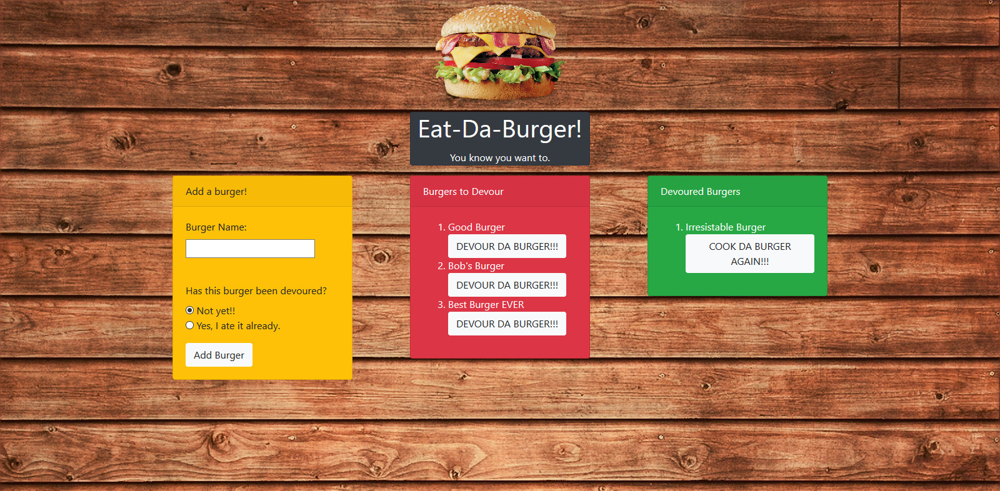

# Eat-Da-Burger App

## Contributors
- kd101jp14

## Live Demo
[Eat-Da-Burger Application](https://evening-journey-13981.herokuapp.com/)

## About
Eat-Da-Burger is an application that allows users to interact with (view, add, and update) a MySQL database via a fun user-friendly, burger-related interface. It is essentially an API (Application Programming Interface) with "GET", "POST", and "PUSH" methods. This application includes a created server and connection, an ORM (Object-Relational Maping), API routes, and a MySQL database. It is organized by the MVC (Model-Controller-View) framework and Express-Handlebars templating engine. This app has been deployed via Heroku. Lastly, it utilizes JawsDB (through Heroku) in order to connect the live app to the MySQL database.
## The Challenge
The main challenge of this project was learning how to create an API using the organization of an ORM, the MVC framework, and Express-Handlebars. Breaking up the code in these ways is useful for focusing on the task at hand, yet learning how each file fits together brought the project to a slow crawl. The ORM especially presented a challenge, as I had to understand how to base the burgers.js model on this module. This challenge was overcome by working through an example from coding boot camp, and working through it line by line, with the ORM and burgers.js model side by side to understand how the two files worked together.

## How to use this application
Visit https://evening-journey-13981.herokuapp.com/ and enjoy!

## Technologies Used
- Node.js
- Express
- Javascript
- MySQL
- Express-Handlebars
- Heroku
- JawsDB
- HTML
- CSS
- Bootstrap

## Preview

## License

This project does not have a license and is not currently open for contributions. Suggestions are welcome.

## Contact
- davis.kyra@rocketmail.com
